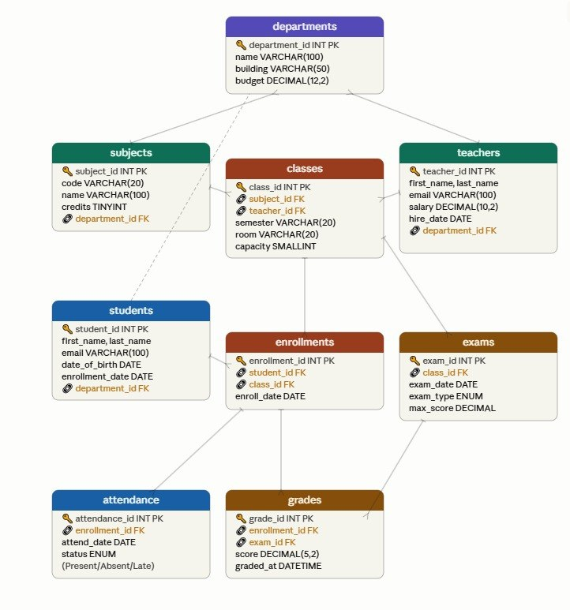

# 🏫 School Management Database System

> A robust, fully normalized relational database system engineered to streamline school operations, including student and teacher management, academic subject assignments, grading, attendance tracking, and transaction concurrency control.

---

## 📑 Table of Contents
- [Overview](#-overview)
- [Key Features](#-key-features)
- [Database Architecture](#️-database-architecture)
- [Data Normalization](#-data-normalization)
- [Project Structure](#-project-structure)
- [Getting Started](#-getting-started)
- [Tools & Technologies](#️-tools--technologies)
- [Future Improvements](#-future-improvements)
- [Team Members](#-team-members)

---

## 📖 Overview
This project delivers a highly optimized backend database structure for a modern educational institution. The database was meticulously designed utilizing rigorous normalization principles (up to the **Fifth Normal Form - 5NF**) to guarantee high data integrity, eliminate data redundancy, and ensure scalable performance as the institution grows. It also implements advanced ACID compliance techniques to handle concurrent transactions safely.

---

## ✨ Key Features
- **Student & Teacher Management:** Securely store and query personal, academic, and financial records.
- **Class Organization:** Manage classroom assignments, capacities, and schedules effectively.
- **Subject Assignment:** Map teachers to specific subjects and students to their registered courses.
- **Grade Tracking System:** Accurately record and compute student academic performance per exam.
- **Attendance Tracking:** Monitor daily student attendance seamlessly.
- **Transaction & Concurrency Control:** Implemented advanced locking mechanisms (Atomic Updates, Pessimistic Locking) and customized Isolation Levels to prevent Lost Updates and read anomalies (Dirty, Non-Repeatable, and Phantom reads).

---

## 🗄️ Database Architecture

### 📊 Entity Relationship Diagram (ERD)


The database follows strict relational design principles. All entities are connected via properly indexed primary and foreign keys (with cascading constraints) to maintain referential consistency. 

**Core Tables:**
* `Departments`
* `Subjects`
* `Teachers`
* `Students`
* `Classes` *(5NF Ternary Relationship)*
* `Enrollments`
* `Exams`
* `Grades`
* `Attendance`
* `Teacher_Subjects` & `Teacher_Skills` *(4NF Bridge Tables)*

---

## 📐 Data Normalization
The complete normalization journey is documented within the `normalization/` directory. By transforming the initial flat data structures, we ensured a robust architecture free of dependencies:
- **First Normal Form (1NF)**
- **Second Normal Form (2NF):** Eliminated Partial Dependencies.
- **Third Normal Form (3NF):** Eliminated Transitive Dependencies.
- **Fourth Normal Form (4NF):** Resolved Multi-valued Dependencies (e.g., separating Teacher Skills and Subjects).
- **Fifth Normal Form (5NF):** Addressed Join Dependencies by preserving ternary relationships losslessly in the `Classes` table.

**Benefits Achieved:**
- [x] Drastically reduced data redundancy and storage waste.
- [x] Eradicated insertion, update, and deletion anomalies.
- [x] Improved query execution speed and overall system reliability.

---

## 📂 Project Structure
```text
school-database-project/
├── schema.sql
├── README.md
│
├── normalization/
│   ├── normalization.md
│   └── normalization.sql
│
├── docs/
│   └── ERD.png
│
├── sample-data/
│   └── insert_data.sql
│
└── queries/
    └── queries.sql
```
---
## 🚀 Getting Started

To run this project locally, follow these steps:

1. **Initialize the Schema:** Run `schema.sql` in your SQL environment to build the tables and relationships.
2. **Populate Data:** Execute `sample-data/insert_data.sql` to inject dummy data for testing purposes.
3. **Test the System:** Run the provided scripts in `queries/queries.sql` to test joins, aggregations, concurrency controls, and data retrieval.

---

## 🛠️ Tools & Technologies
* **Database Engine:** MySQL
* **Language:** SQL (DDL, DML, DQL, TCL)
* **Design Methodology:** Database Normalization (1NF - 5NF), ACID Properties
* **Modeling Tool:** draw.io (for Entity Relationship Diagram)

---

## 🔮 Future Improvements
- [ ] Develop a full-stack web interface (Frontend + Backend APIs) utilizing PHP and Laravel.
- [ ] Implement a comprehensive Role-Based Access Control (RBAC) and User Authentication system.
- [ ] Build automated dashboards for administrative reports and analytics.
- [ ] Integrate a Machine Learning module for predicting student performance.

---

## 👥 Team Members
Developed with ❤️ by:
* [Shady Algammal](https://github.com/Sh-algammal)
* [Haitham Nofal](https://github.com/Haitham-nofal)
* [Sohail Emad](https://github.com/SohailEmad99)
* [Omar Andeel](https://github.com/OmarAndeel)
* [Zyad Elshopaky](https://github.com/ZyadElshopaky)
